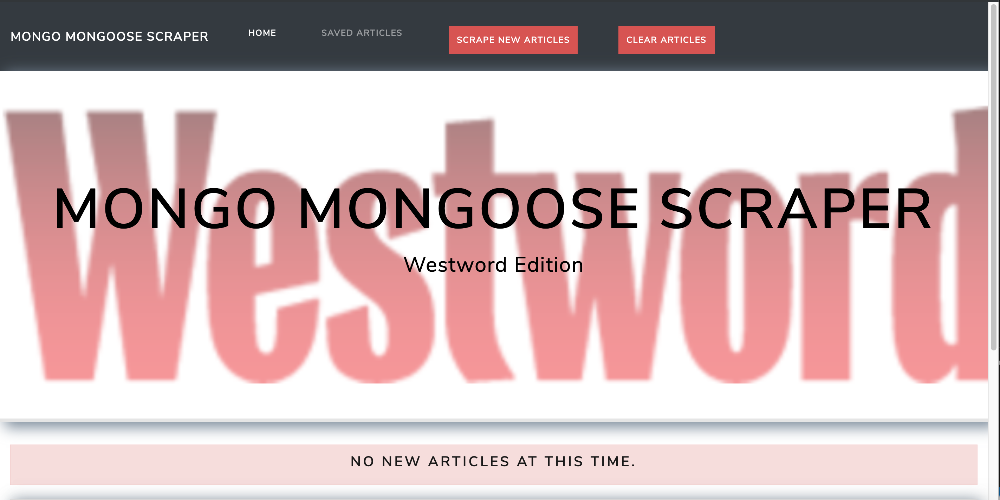

# mongo-mongoose-scraper

## Overview
This app scrapes and displays headlines from Westword.com. Users may also save and comment on those articles. All data is stored in a Mongo database.

## Tools Used
MongoDB, Mongoose, Cheerio, Express, Handlebars, jQuery, Bootstrap

## Getting Started
Navigate to the [homepage](https://mongo-mongoose-scraper.herokuapp.com/).

Click **Scrape New Articles** button to retrieve the current Westword headlines.

Click **Clear Articles** to clear out articles.

Scraped articles may be saved if desired.

Saved articles may be deleted when desired.

Add comments by clicking the **Notes** button on saved articles. Delete notes by clicking the red **X** button.

